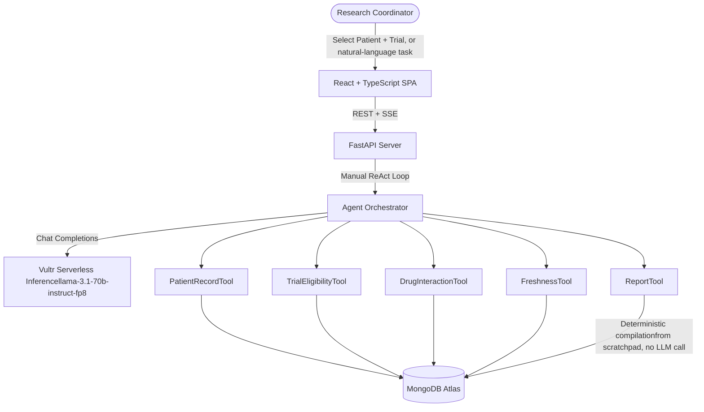

# AURA Clinical Agent

**An autonomous enterprise AI agent for hospital research staff, built for the RAISE Summit Hackathon 2026 — Vultr Enterprise Agent track.**

AURA evaluates whether a patient qualifies for a clinical trial by planning a multi-step investigation, retrieving real hospital records, cross-checking drug exclusions, verifying that supporting documents haven't expired against hospital policy, and producing an evidence-backed report where every claim traces back to a specific retrieved record.

It is not a chatbot, not a diagnosis tool, and not a document-search assistant. It is a staff-facing decision-support system that behaves the way a careful research coordinator would: gather everything relevant, check it against the rules, and explain exactly why it reached its conclusion.

---

## Table of Contents

- [Why This Fits the Vultr Enterprise Agent Track](#why-this-fits-the-vultr-enterprise-agent-track)
- [What This Is Not](#what-this-is-not)
- [Architecture](#architecture)
- [Tech Stack](#tech-stack)
- [Database Schema](#database-schema)
- [How the Agent Actually Works](#how-the-agent-actually-works)
- [Engineering Highlights](#engineering-highlights)
- [Getting Started](#getting-started)
- [Demo Scenario](#demo-scenario)
- [Project Structure](#project-structure)

---

## Why This Fits the Vultr Enterprise Agent Track

The track calls for a web-based enterprise agent that grounds its decisions in documents, plans and retrieves adaptively rather than answering from a single lookup, calls real tools, makes decisions, and produces an outcome a real enterprise team could use — with the clinical-trial-matching workflow given as the track's own worked example.

AURA implements that workflow directly and completely:

|
 Requirement 
|
 How AURA satisfies it 
|
|
---
|
---
|
|
 Plans a workflow, doesn't single-shot an answer 
|
 A manual ReAct loop plans each next step based on what it has learned so far, up to 10 steps per evaluation 
|
|
 Retrieves more than once, adaptively 
|
 Retrieves patient demographics, conditions, medications, observations, and allergies; retrieves trial details and eligibility criteria; retrieves drug interaction rules; retrieves hospital policy thresholds — as separate, reasoned steps, not one query 
|
|
 Calls tools, makes decisions 
|
 Five specialist tools (below) are invoked based on the model's own reasoning, not a hardcoded sequence 
|
|
 Produces an actionable enterprise outcome 
|
 A structured report stating eligibility status, satisfied/unsatisfied criteria, missing or expired documents, drug conflicts, and required next actions for the coordinator 
|
|
 Grounds every decision in documents 
|
 Every citation in the final report references a specific MongoDB record (collection, ID, field, value) — never a paraphrase, never a model-invented fact 
|

## What This Is Not

To be explicit, since this matters for the track's disqualification criteria:

- **Not a medical advice or diagnosis tool.** AURA never recommends treatment. It answers exactly one question — is this patient eligible for this trial — for hospital staff, not patients.
- **Not a chatbot.** The primary interaction is a structured Select Patient → Select Trial → Evaluate workflow. A lightweight Agent Console allows staff to phrase the same task in natural language, but it resolves to the identical evaluation pipeline — there is no open-ended conversational assistant.
- **Not basic RAG.** There is no vector database, no embeddings, and no semantic document search anywhere in this system. All underlying data is structured (patient records, trial eligibility criteria, drug rules, hospital policies), so every tool performs a direct, typed database query. Retrieval here means the agent deciding *what to look up next and why*, not similarity search over a document store.
- **Not a dashboard.** The dashboard (Patients, Trials, Reports) exists for direct navigation, but the product's core value is the autonomous evaluation agent, not the data views around it.

## Architecture



The orchestrator is a **plain Python ReAct loop with no agent framework** (no LangChain, no CrewAI, no AutoGen) — every planning step, tool call, and citation check is implemented directly so the full reasoning path is inspectable and auditable end to end.

## Tech Stack

**Frontend:** React, TypeScript, Vite, Tailwind CSS, React Query, React Router, Lucide Icons

**Backend:** Python (FastAPI), Pydantic v2, Motor (async MongoDB driver), Uvicorn, HTTPX

**Database:** MongoDB Atlas

**AI:** Vultr Serverless Inference, OpenAI-compatible chat completions API, `llama-3.1-70b-instruct-fp8`

**Deployment:** Vercel (frontend), Render (backend)

## Database Schema

|
 Collection 
|
 Purpose 
|
|
---
|
---
|
|
`patients`
|
 Demographics, birthdate, identifiers 
|
|
`conditions`
|
 Diagnostic codes and descriptions per patient (SNOMED-CT) 
|
|
`medications`
|
 Prescription history, dosage, active/inactive status 
|
|
`observations`
|
 Labs, vitals, and measurements (LOINC-coded) 
|
|
`encounters`
|
 Clinic visit history 
|
|
`procedures`
|
 Logged procedures and diagnostic exams 
|
|
`careplans`
|
 Patient care guidelines 
|
|
`allergies`
|
 Drug/food/environmental allergy records 
|
|
`trials`
|
 Registered clinical trial protocols 
|
|
`trial_eligibility`
|
 Structured inclusion/exclusion criteria per trial 
|
|
`drug_rules`
|
 Drug-drug interaction and exclusion rules 
|
|
`hospital_policies`
|
 Document validity windows (e.g. "CBC valid for 90 days") 
|
|
`agent_runs`
|
 Full audit trail of every evaluation: every step, tool call, timing, and the final report 
|

Patient, clinical, and encounter data is derived from [Synthea](https://github.com/synthetichealth/synthea) synthetic patient generation. Trial data is sourced from real, public trial listings. No real patient data is used anywhere in this system.

## How the Agent Actually Works

1. **Planning loop.** The orchestrator runs a manual ReAct loop, capped at 10 steps. At each step, the model returns strict JSON: either a `thought` plus an `action` (a tool to call), or a `thought` plus a `final_answer`. There is no free-form prose outside this contract.
2. **Step caching.** Tool results are cached within a run's scratchpad by hashing the tool name and its input. A repeated call with identical inputs returns the cached result instantly rather than re-querying MongoDB or re-prompting the model.
3. **Citation validation.** Every citation in a `final_answer` is checked against the records actually retrieved during that run. A citation that can't be traced to real retrieved data triggers one corrective re-prompt; if it's still unverified after that, it's stripped from the report rather than shown as fact.
4. **Deterministic report compilation.** The final report — eligibility decision, satisfied/unsatisfied criteria, evidence coverage percentage, outstanding requirements — is compiled entirely in Python from the run's own scratchpad. The model is never asked to restate or summarize the outcome a second time, which is what guarantees the report always matches the reasoning that produced it.
5. **Live execution timeline.** Each step streams to the frontend over Server-Sent Events as it happens, labeled by which specialist tool ran, with real elapsed time per step — so the evaluation is visibly happening, not a black box.

## Engineering Highlights

A few production issues surfaced and fixed during development, worth calling out because they reflect real engineering rather than a demo that only works once:

- **Context window management.** Some patients have tens of thousands of observation records — enough to overflow the model's context window and cause request failures. Large clinical collections are capped to a bounded number of most-relevant items before being placed in the prompt, while smaller catalog data (patients, trials) can be passed in full.
- **Tolerant JSON parsing.** Early runs occasionally failed when the model appended stray text after a valid JSON object. The parser now extracts the first complete JSON object from a response rather than requiring the entire response to be pure JSON, with a corrective retry as a second line of defense.
- **Deterministic-first, LLM-second.** Anywhere a number or fact could be computed directly from structured data (evidence coverage, satisfied-criteria counts, age), it is computed in Python — the model is never asked to produce a number that code can compute exactly.
- **SPA routing on Vercel.** Deep-linked routes (e.g. reloading a specific report URL) are correctly rewritten to the app shell rather than 404ing, via an explicit Vercel rewrite rule.
- **No vector search, by design.** Because the underlying data is structured rather than freeform documents, retrieval is direct MongoDB queries rather than an embeddings/vector-search layer — a deliberate simplification that removes an entire class of retrieval failure modes without sacrificing the "grounded in documents" requirement.

## Getting Started

### Prerequisites

- Python 3.11+
- Node.js 18+
- A MongoDB instance (local or Atlas)
- A Vultr Serverless Inference API key

### Backend Setup

```bash
cp .env.example .env
# edit .env with your VULTR_API_KEY and MONGO_URI

pip install -r backend/requirements.txt
python backend/app/seed/run_all.py
uvicorn backend.app.main:app --host 127.0.0.1 --port 8000 --reload
```

### Frontend Setup

```bash
cd frontend
npm install
npm run dev
```

Open `http://localhost:5173`.

### Health Check

```bash
curl http://127.0.0.1:8000/health
```

Should return MongoDB and Vultr connectivity status.

## Demo Scenario

The seeded dataset includes a dedicated demo patient designed to exercise every subsystem in one evaluation: an NSCLC diagnosis matching an active trial, an expired CBC and LFT relative to hospital policy, a missing ECG, and an active medication that conflicts with the trial's exclusion rules. Running an evaluation against this patient produces a **conditionally eligible** result with real policy citations, a real drug-conflict flag, and explicit outstanding requirements — demonstrating planning, multi-step retrieval, tool use, and evidence-backed decision-making in a single run.

## Project Structure

```
backend/
  app/
    api/          REST routers
    agent/        orchestrator, planner, memory, tool registry
    agent/tools/  PatientRecordTool, TrialEligibilityTool, DrugInteractionTool, FreshnessTool, ReportTool
    models/       Pydantic schemas
    seed/         data import scripts
frontend/
  src/
    pages/        Landing, Dashboard, Patients, Trials, Reports, Run/Evaluation
    components/   shared UI, reasoning timeline, report renderer
data/
  patients/       Synthea-derived patient records (CSV)
  trials/         trial, eligibility, and intervention data
  policies/       hospital policy JSON
  drug_interactions/  curated drug interaction rules
```

---

Built for RAISE Summit Hackathon 2026, Vultr Enterprise Agent track.